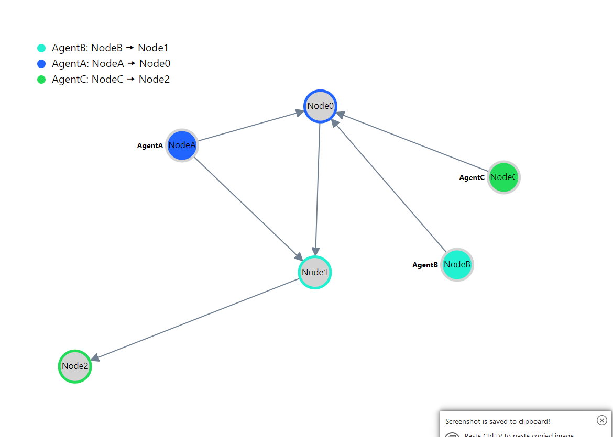

# cs0170-spring-2021-multiagent-pathfinding
[comment]: <> (This is a mark down file, and is intended to be read that way!)
## Multi-Agent Pathfinding (MAPF):
## Introduction:
Multi-Agent Pathfinding is a novel concept generated during the cusp of deep reinforcement learning. While having multiple agents navigating on the same graph is novel enough in its potentials for parallelization, the true novelty of Multi-agent Pathfinding comes in its key restriction - that agents following the paths may not collide with one another. With that seemingly tiny change, Multi-Agent Pathfinding has arisen with major applications in topics such as <b>factory robotics, simulated interactive modelings in video games, and more, etc</b>.
<br /><br />
Solving a pathfinding problem is rather trivial when number of agent is only one, it is quite literally just a reachability problem. However, the question gets increasingly complicated when multiple agents and conditions are involved. In addition to having to handle multiple agents, the requirement vary so that no Agents will follow each other, none will collide, etc. While the area is new, there has been some proposed solutions to resolve the issue. However, what's more surprising is that there are constraint based solvers that could resolve these MAPF problems without needing to figure out how to solve the problem directly (1). The reason why this is useful is because many SAT solvers are optimized enough so that they could retrieve the answers in a time that fares well relative to even other methods (1).
<br /><br />
In our project, we modeled the process of Multiagent Pathfinding in Forge and <b>implemented a MAPF Solver</b> that produces a solution (if it exists) to the MAPF problem with the shortest time steps. In addition, we have also explored some properties that will be verified in our Forge file.
## The Solver:
The Solver applies a technique known as "Counter-Example Guided Inductive Synthesis" (2). It first takes in a text file with specific input specifications and converts it to a Forge Instance that our Forge file can operate on. Then in each iteration of a for loop, starting with n = 1, the solver sets the max trace length to n and checks if the instance is satisfiable. If it is, then the solver will exit the loop and return the answer. The reason why the answer will be the one with the optimal timestep is because all instances of timestep below the current timestep has yielded unsat.

Note that this solver is incomplete, meaning it will only terminate on UNSAT instances when Forge exceeds its own capacity in calculations and shuts down.
## Design Questions:
- What tradeoffs did you make in choosing your representation? What else did you try that didn’t work as well?
    - The biggest decision we made was to have agents all move in parallel instead of one at a time. This is because multiple agents in the real world can operate at the same time, so letting all agents to choose to move and wait is better than say, in each turn, only one agent moves while every other agent waits. This complicated our node collision predicate, because now it is possible for Collisions to occur when two agents decide to swap their location, where they will collide on the edge. But only specifying that no two agents can occupy the same node won't catch it.
    - Another smaller decision was to have sigs for the edges, instead of just relations on nodes. This allows for edges to contain information such as the weight of the edge that affects the pathfinding much more easily. This is better suited for extensiability as compared to adding them in Nodes.
- What assumptions did you make about scope? What are the limits of your model?
    - We assumed that multi agent pathfinding was well defined, but it turns out there are quite a large amount of subtleties that can be considered when determining collisions, each of which drastically changes the scope of the project. For our project, we chose two collision conditions: agents cant occupy the same node, and agents can't swap nodes along the same edge. But there are certainly more conflicts a system may consider, such as a following conflict where one Agent is tailing another, etc (3). 
    - We also chose to let the Agent stay on their target (they could still move out of the way if needed) once they have reached their destination. But there are certainly scenarios where the agent could disappear when they have reached their target (3).
- Did your goals change at all from your proposal? Did you realize anything you planned was unrealistic, or that anything you thought was unrealistic was doable?
-   - Our original target was somewhat unsuitable and unrealistic for Forge as some properties we wanted to check are far more well-suited in Integers as opposed to Bit Vectors. Therefore, rather than checking for the number of time steps each Agent would take (num-steps) inside of Forge itself, we moved that part to be instead with our forge/core file.
    - As for the plan of Dijkstra/A* to find the solution to the MAPF problem with the least sum of costs. We determined that forge was not especially well suited to modeling modeling optimality problems. However using <b>forge/core</b> allowed us to instead determine a temporally optimal path for the agents. Due to this nuance, the goal that we orignally proposed was slightly altered. We still achieved multi-agent pathfinding, but not necessarily in the way we had envisioned. 
- How should we understand an instance of your model and what your custom visualization shows?
    - Instances are a collection of Nodes, Edges, and Agents. Agents point to the nodes they are currently "on" (indicated by their position relation). The sterling graph is pretty unintelligible, so we created a much more readable graph in our visualization. Each agents has a color, and the node that the agent is on is colored in that color. Each agents destination node is outlined in the agent's color. There's also a legend on the side that details the Agent, its color, its start, and its destination for each agent.

## Files:
### example
This is the folder that houses example input files that our MAPF Solver would take.
### collaborators
The list of collaborators we have for our Final Project.
### graphviz.js
The Visualizer of Our Project
### input.txt
A complicated example we will show during our Demo!
### mapf.rkt
The core Forge File we have that models the MAPF Problem and verifies properties of them.
### mapf_solver.rkt:
The MAPF Solver built on the basis of mapf.rkt
### parse-file.rkt
Converts the text file to Forge Instances

## How to Run Solver:
To run the solver:
```
racket mapf_solver.rkt <path_to_file>
```
The solver takes in a text file of the following input specification:
- The first line of the file should contain two numbers separated by a space, the first being the number of nodes, and the second being the number of Agents
- For each Node, they are represented as:
```
<Name of Node> <...Neighbor of Node, each separated by a space>
       <...Weight of the Edge to each respective Node above, each separated by a space>
```
- For each Agent, they are represented as:
```
<Name of Agent> <Starting Node of Agent> <Destination Node of Agent>
```
An example file looks like:
```
4 2
Node0 Node3 Node1
      1 2
Node1 Node2
      1
Node2 Node1
      1
Node3 Node1
      1
AgentA Node0 Node3
AgentB Node1 Node2
```
### Note:
To make a Node with zero edges extending out, you need to leave a blank line afterwards, so, ex:
```
NodeEmpty

```
Would be a valid line.
All Nodes with blank lines should also be the last Nodes in the file specified. For more, see example/blank-line.txt.

## Important Notice:
Thomas, who offered to help us figure out integrating our Forge files to forge/core, aided us in letting us write mapf_solver.rkt while providing support as a TA. The I/O parsing of text files (parse-file.rkt) to forge instances was directly provided by Thomas who believed that racket macro was too cumbersome and irrelevant to what we are doing to make us learn. Thank you Thomas!
## References:
- [( 1. )](https://arxiv.org/ftp/arxiv/papers/1610/1610.05452.pdf) Makespan Optimal Solving of Cooperative Path-Finding via Reductions to Propositional Satisfiability by Pavel Surynek.
- ( 2. ) Email Exchange with Professor Tim Nelson :)
- [( 3. )](https://arxiv.org/pdf/1906.08291.pdf) Multi-Agent Pathfinding: Definitions, Variants, and Benchmarks
